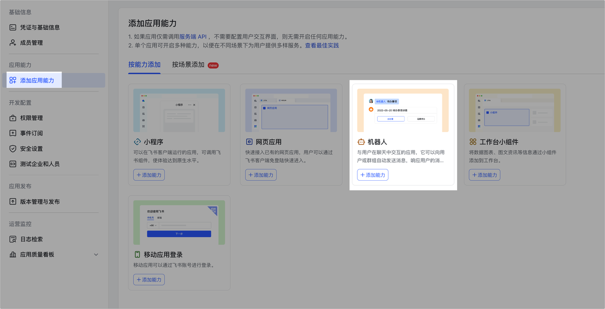
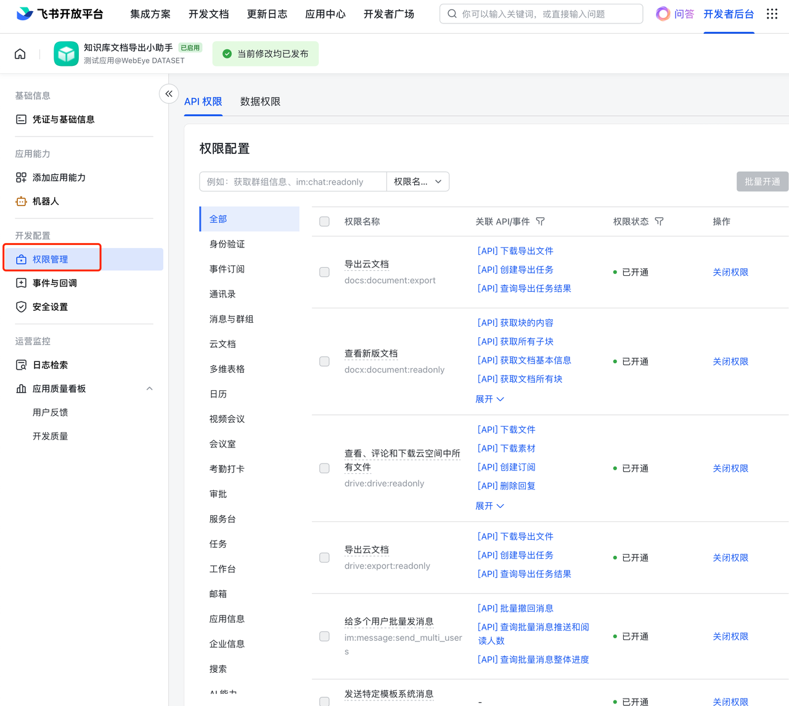
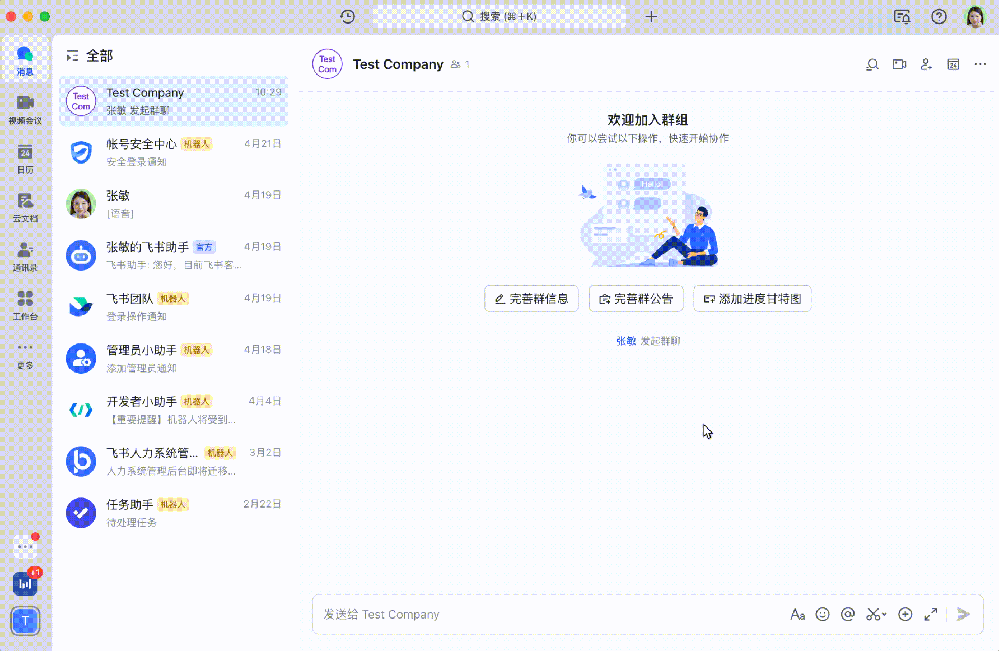
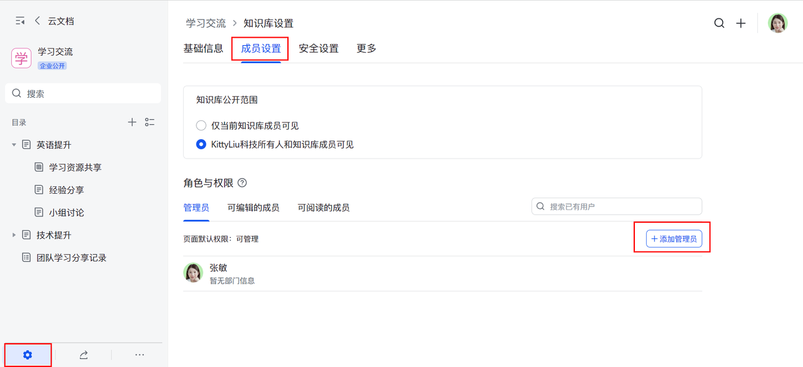
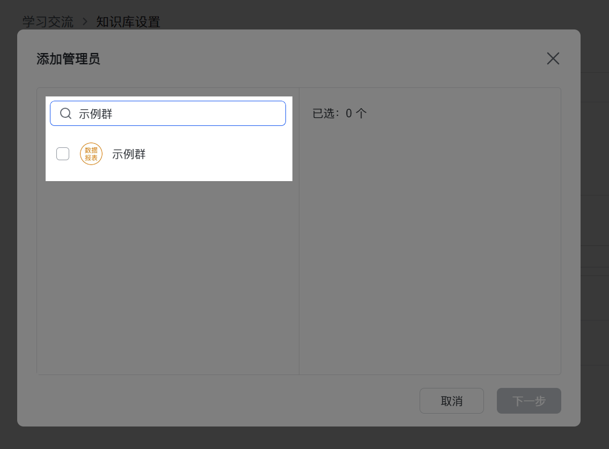
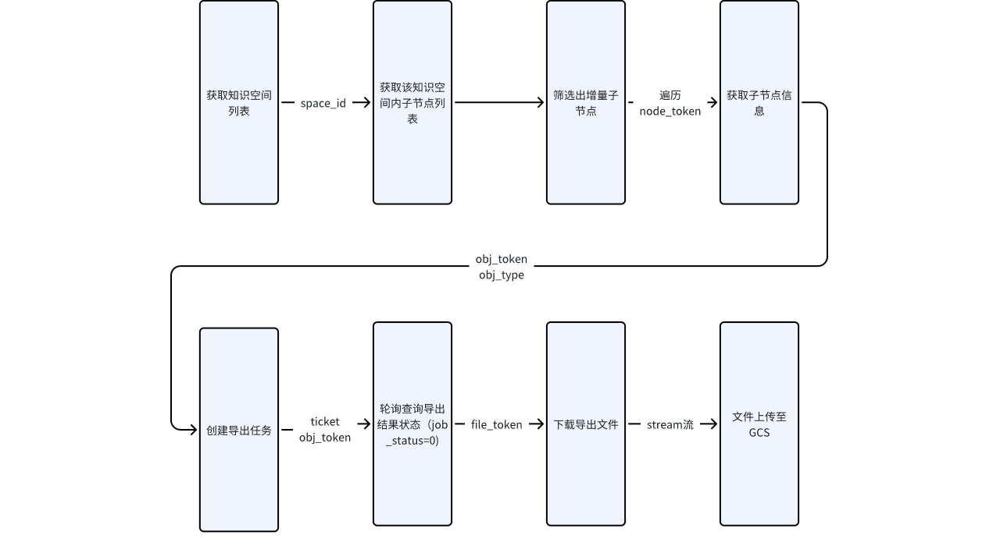

## 将飞书知识库文档增量导出并上传至GCS demo

### 前置工作-创建应用机器人

1. 请访问 开发者后台 创建一个新应用，并获得：
    * `App ID` - 飞书应用编号
    * `App Secret` - 请注意保管 App Secret，不要泄露到互联网。
2. 在应用管理页面，点击添加应用能力，找到机器人卡片，点击 +添加。

3. 为应用开启如下权限
    - `docx:document:readonly`
    - `wiki:wiki:readonly`
    - `drive:drive:readonly`
    - `docs:document:export`
    - `docx:document:readonly`
    - `drive:drive:readonly`
    - `drive:export:readonly`
    - `wiki:wiki:readonly`

4. 将应用发布正式版本，并确保审批通过。测试开发阶段开发人员也可创建测试企业进行应用的测试，测试企业无需审批即可进行测试，避免了企业审批的延迟性。
5. 在飞书客户端，创建一个新的群组，将应用添加为群机器人。

6. 知识库管理员前往「知识库设置」-> 「成员设置」，在此选择添加的角色：管理员、可编辑的成员或可阅读的成员。

7. 搜索包含机器人的群聊，添加该群为管理员或成员。

### 流程图

### 修改`conf.py`中的各配置参数

| 参数名称              | 描述               | 值                                  |
|-------------------|------------------|------------------------------------|
| `app_id`          | 飞书应用编号           | `xxxxx`                            |
| `app_secret`      | 飞书应用密钥           | `xxxx`                             |
| `BASE_URL`        | 飞书 API 的基础 URL   | `https://open.feishu.cn/open-apis` |
| `SERVICE_ACCOUNT` | GCP服务账户的JSON凭证文件 | `xxxxxx.json`                      |
| `WIKI_NAME`       | 飞书知识库名称          | `学习交流`                             |
| `BUCKET_NAME`     | GCS的存储桶名称        | `feishu-docs`                      |

### 参考文档

- https://open.feishu.cn/document/server-docs/docs/wiki-v2/wiki-qa
- https://open.feishu.cn/document/server-docs/docs/wiki-v2/space/list
- https://open.feishu.cn/document/server-docs/docs/wiki-v2/space-node/list
- https://open.feishu.cn/document/server-docs/docs/wiki-v2/space-node/get_node
- https://open.feishu.cn/document/server-docs/docs/drive-v1/export_task/create
- https://open.feishu.cn/document/server-docs/docs/drive-v1/export_task/get
- https://open.feishu.cn/document/server-docs/docs/drive-v1/export_task/download